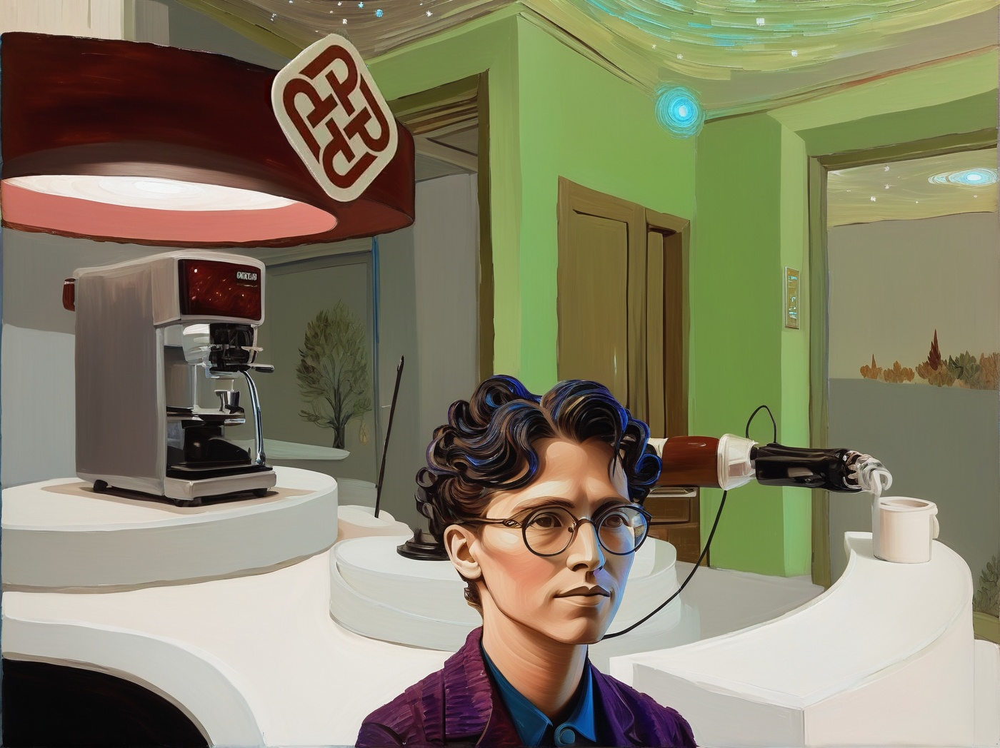

# Ultra-Persona


# PolySmart Persona - Personalized Image Generator



Generate personalized images with multiple artistic stylings in PolyU (Hong Kong Polytechnic University) backgrounds.

## Table of Contents
- [Features](#features)
- [Installation](#installation)
- [Usage](#usage)
- [Parameters](#parameters)
- [Examples](#examples)
- [Project Structure](#project-structure)
- [Author](#author)

## Features
- 🖼️ Three-step image generation process:
  1. High-resolution face generation using IP-Adapter-Face-ID
  2. Background merging with PolyU landmarks
  3. Artistic style transformation
- 🏫 8 PolyU background options
- 🎨 9 artistic styling options
- 💾 Automatic result storage with organized directory structure

## Installation
1. Clone repository:
```bash
git clone https://github.com/yourusername/polysmart-persona.git
cd polysmart-persona
```

2. Install dependencies:
```bash
pip install -r requirements.txt
```

3. Install PyTorch with CUDA support (recommended):
```bash
pip3 install torch torchvision torchaudio --index-url https://download.pytorch.org/whl/cu118
```

## Usage
```python
from persona import Persona
import cv2

# Initialize with sample parameters
input_image = cv2.imread("input.jpg")
input_image = cv2.cvtColor(input_image, cv2.COLOR_BGR2RGB)

psa = Persona(
    background_choice=1,
    input_image=input_image,
    styling_choice=3,
    prompt="A professional portrait"
)

# Execute generation pipeline
psa.face_generator_emb()
psa.extract_and_merge()
final_img = psa.img_styling()

# Save result
cv2.imwrite("output.jpg", final_img)
```

## Parameters
### Background Options
1. Jockey Club Innovation Tower
2. P504 Student Lab
3. PolyU Great Lawn
4. A Garden
5. Clock Square
6. Library Gate
7. Library G Floor
8. PolyU Garden Restaurant

### Styling Options
1. Van Gogh Starry Night
2. One last kiss
3. Professional 3D
4. JoJo Style
5. Cyberpunk 2077
6. Medieval Style
7. Abstract Animation
8. Miro Style
9. Modigliani

## Examples
```python
# Full pipeline example with lab background
psa = Persona(
    background_choice=2,
    input_image=cv2.cvtColor(cv2.imread("photo.jpg"), cv2.COLOR_BGR2RGB),
    styling_choice=5,
    prompt="Cyberpunk student portrait"
)
```

## Project Structure
```
├── ip_adaptor_face/          # Face generation module
├── unet_merge/               # Background merging
├── ImageStyling/             # Style transformation modules
│   ├── protovision.py
│   ├── animation.py
│   └── ...                  
├── logo/                     # PolyU branding assets
├── Result_imgs/              # Generated output storage
└── persona.py                # Main class
```
## Notes
- 🚦 Hardware Requirements: NVIDIA GPU recommended for optimal performance
- 💾 Storage: Update `storage_mapping` paths in Persona class for your environment
- 🖼️ Input Images: Use high-quality face images (600x600+ pixels recommended)


## Author
**Duman**  
PolyU COMP Department  
📅 Last Updated: 2025/2/28

